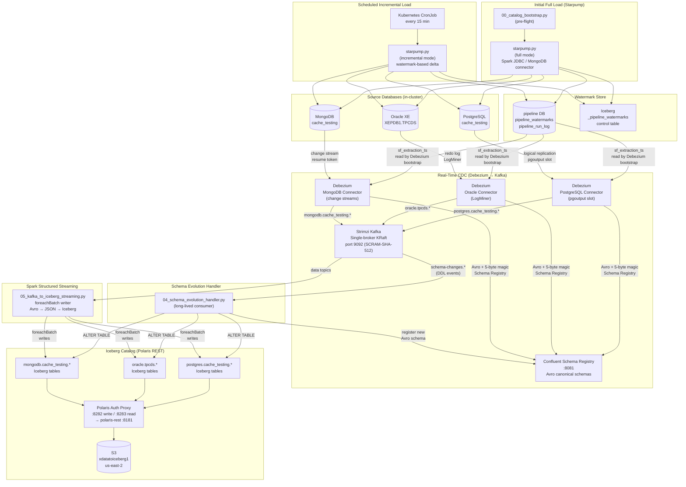
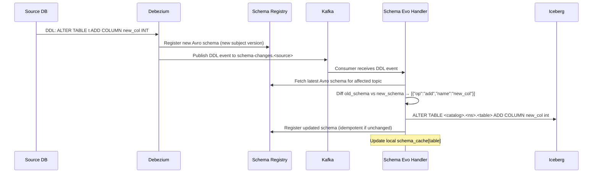

# CDC + Batch Pipeline Architecture

> **Version:** 1.0  
> **Last updated:** 2025  
> **Maintainer:** Platform Engineering  

---

## Overview

This document describes the complete architecture of the Starpump + Debezium/Kafka → Iceberg CDC & Batch Pipeline running on the `k8s-platform` Kubernetes cluster.

The pipeline replicates data from three external database systems — **PostgreSQL**, **Oracle**, and **MongoDB** — into **Apache Iceberg** tables hosted on **S3** and catalogued by **Apache Polaris** (REST catalog). It supports both initial full loads and ongoing real-time change data capture.

---

## End-to-End Data Flow



---

## Component Responsibilities

### `00_catalog_bootstrap.py`
- **Role:** Pre-flight validator and namespace creator.
- Creates Iceberg namespaces in Polaris for each source catalog if they don't exist.
- Called by both `starpump.py` and `05_kafka_to_iceberg_streaming.py` at startup.
- Idempotent — uses `CREATE NAMESPACE IF NOT EXISTS`.
- Validates live connectivity to Polaris REST after creation.

### `starpump.py` (extended)
- **Role:** Universal source-to-Iceberg batch copy engine.
- **full mode (default):** Copy all filtered tables in parallel (N threads, batch pagination).
- **incremental mode:** Read watermark from `pipeline_watermarks`, extract only rows newer than the last timestamp, update watermark on success.
- **custom_sql mode:** Execute a user-supplied SQL query (incl. multi-table JOINs) and land results into a named Iceberg table.
- **DDL drift detection:** Before each copy, compare source schema against Iceberg table schema; emit `ALTER TABLE` for any ADD/DROP/MODIFY column.
- All modes write dual watermarks: `pipeline_watermarks` (pipeline DB) + `_pipeline_watermarks` (Iceberg control table).

### `docker/spark-gluten-velox/scripts/debezium/register_*.sh`
- **Role:** Register Debezium connectors after initial load.
- Read `sf_extraction_ts` from `pipeline_watermarks`.
- Resolve Oracle SCN from timestamp via `TIMESTAMP_TO_SCN()`.
- Ensure PostgreSQL replication slot + publication exist.
- Register connector config with all performance tuning parameters.
- Verify connector status after registration.

### `04_schema_evolution_handler.py` (extended)
- **Role:** Long-lived Kafka consumer handling DDL change events from all three sources.
- Consumes `schema-changes.postgres`, `schema-changes.oracle`, `schema-changes.mongodb`.
- For each DDL event: fetches new Avro schema from Schema Registry, diffs against cached schema, applies `ALTER TABLE` to Iceberg via Spark SQL.
- Updates Schema Registry subject with the new Avro schema.
- Runs one thread per source in multi-source mode; single-source via `SOURCE=<name>`.

### `05_kafka_to_iceberg_streaming.py`
- **Role:** Spark Structured Streaming consumer that moves CDC events from Kafka into Iceberg.
- One streaming query per source, regex topic subscriptions.
- Avro-to-JSON deserialization via Confluent Schema Registry (5-byte magic header).
- `foreachBatch` writer routes each micro-batch to the correct Iceberg table.
- Creates Iceberg tables on first sight (with `hours(snap_timestamp) + bucket(16, pk)` partition spec).
- `mergeSchema=true` handles schema evolution inline.

---

## Watermark Handoff Between Starpump and Debezium

The CDC sync-point is the critical link ensuring Debezium starts exactly where Starpump left off:

```
1. Starpump captures source server-side timestamp BEFORE first batch SELECT.
   This timestamp is the "point in time" the full copy represents.
   
2. Starpump writes sf_extraction_ts to:
   a. pipeline DB: pipeline.pipeline_watermarks (shell-accessible)
   b. Iceberg: <catalog>.<namespace>._pipeline_watermarks (Spark-accessible)
   c. Iceberg table property: 'pipeline.sf_extraction_ts'
   
3. Debezium bootstrap script reads sf_extraction_ts from pipeline DB:
   - PostgreSQL: snapshot.mode=never → connector resumes from replication slot LSN
     (which is at the current position when the slot was created after starpump)
   - Oracle: converts sf_extraction_ts → Oracle SCN via TIMESTAMP_TO_SCN()
     Debezium starts from that SCN (snapshot.offset.scn)
   - MongoDB: snapshot.mode=never → connector resumes from change stream
     resume token at current position after initial load
     
4. No gap, no overlap: Debezium captures all changes that occurred
   AFTER starpump's extraction timestamp.
```

---

## Schema Evolution Flow



---

## Partitioning Strategy

Every Iceberg table in this pipeline uses a **two-level partition spec**:

| Level | Transform | Column | Rationale |
|-------|-----------|--------|-----------|
| 1 | `hours(snap_timestamp)` | `snap_timestamp` | Range partition by write hour — enables efficient time-range queries and data lifecycle management |
| 2 | `bucket(16, <pk>)` | primary key column | Hash-distributes rows within each hour — prevents hotspot files when many rows share the same write timestamp; 16 buckets balances file count vs parallelism |

The `bucket` count is **16** for CDC streaming tables (vs 4 in the legacy `_auto_partition_spec()`). This accommodates higher CDC event rates: MongoDB products has 19.8M rows, PostgreSQL customers has 444K — 16 buckets produces ~1.2M rows per bucket at current scale, well within the 256 MB target file size.

---

## Performance Tuning Rationale

### Kafka Producer (Debezium)
| Parameter | Value | Rationale |
|-----------|-------|-----------|
| `linger.ms` | 5 | Wait 5 ms to accumulate messages into batches — reduces round-trips by ~10× vs default 0ms |
| `batch.size` | 65536 (64 KB) | Optimal for Avro CDC payloads (~500B avg → ~130 msgs/batch) |
| `compression.type` | lz4 | Best latency/ratio tradeoff for structured data; ~60-70% size reduction |
| `acks` | 1 | Leader-only acknowledgment — safe on single-broker; `all` requires min.insync.replicas>1 |
| `buffer.memory` | 33554432 (32 MB) | Sufficient for burst CDC bursts without blocking the connector |

### Kafka Consumer (Spark Streaming)
| Parameter | Value | Rationale |
|-----------|-------|-----------|
| `fetch.min.bytes` | 65536 | Wait for 64 KB before returning a fetch response — reduces small fetches during quiet periods |
| `fetch.wait.max.ms` | 500 | Max wait for min.bytes — caps latency at 500ms in quiet periods |
| `max.poll.records` | 500 | Process up to 500 records per poll — balanced for Spark micro-batch processing |
| `maxOffsetsPerTrigger` | 50000 | Back-pressure: caps records per Spark micro-batch at 50K — prevents OOM on burst |

### Debezium Connector
| Parameter | Value | Rationale |
|-----------|-------|-----------|
| `max.batch.size` | 8192 | Debezium internal buffer — 8K events per batch balances throughput and memory |
| `max.queue.size` | 16384 | Internal change queue capacity — 2× batch size provides headroom during bursts |
| Oracle `log.mining.batch.size.max` | 100000 | Large batch → fewer LogMiner sessions → less Oracle PGA consumption |
| Oracle `log.mining.sleep.time.max.ms` | 3000 | Back off 3s when log is idle — frees Oracle resources during quiet periods |

### Iceberg Write
| Parameter | Value | Rationale |
|-----------|-------|-----------|
| `write.target-file-size-bytes` | 268435456 (256 MB) | Standard Iceberg recommendation — balances file count vs S3 PUT cost |
| `format-version` | 2 | Required for row-level deletes (MERGE, UPSERT support) |
| `write.format.default` | parquet | Best Spark/Iceberg read performance; snappy compression |
| Partition `hours(snap_timestamp)` | hourly | Data lifecycle: easy to expire old CDC data by partition |

---

## Catalog Naming Convention

| Technology | Spark Catalog Name | Polaris Warehouse | Iceberg Namespace |
|------------|-------------------|-------------------|-------------------|
| PostgreSQL | `postgres` | `pg_lakehouse` | `cache_testing` |
| Oracle | `oracle` | `ora_lakehouse` | `tpcds` |
| MongoDB | `mongodb` | `mgo_lakehouse` | `cache_testing` |

All catalogs are `type=rest` pointing to Polaris Auth Proxy at `:8283` (read) / `:8282` (write).

---

## Security

- **All credentials** stored in OpenBao at `secret/data/platform/<source>`.
- **Kafka:** SCRAM-SHA-512 on port 9092 (operator/Debezium/Spark); Kerberos GSSAPI on port 9093 (user-facing).
- **Polaris:** OAuth2 service account (`spark_svc_id:spark_svc_secret`) for each catalog write.
- **S3:** AWS access key/secret from OpenBao; path-style access; `s3://xdatatoiceberg1/`.
- **RBAC:** `SPARK_USER=dave` has `can_admin_catalog=true` + `can_write_iceberg=true`.

---

## File Inventory

| File | Location | Purpose |
|------|----------|---------|
| `00_catalog_bootstrap.py` | `docker/spark-gluten-velox/scripts/` | Pre-flight catalog namespace creation |
| `starpump.py` | `docker/spark-gluten-velox/scripts/` | Batch copy engine (full, incremental, custom_sql) |
| `04_schema_evolution_handler.py` | `docker/spark-gluten-velox/scripts/` | Multi-source DDL evolution consumer |
| `05_kafka_to_iceberg_streaming.py` | `docker/spark-gluten-velox/scripts/` | Spark Structured Streaming CDC consumer |
| `register_postgres_connector.sh` | `docker/spark-gluten-velox/scripts/debezium/` | PostgreSQL Debezium connector registration |
| `register_oracle_connector.sh` | `docker/spark-gluten-velox/scripts/debezium/` | Oracle Debezium connector registration |
| `register_mongodb_connector.sh` | `docker/spark-gluten-velox/scripts/debezium/` | MongoDB Debezium connector registration |
| `kafka-topics.yaml` | `manifests/cdc-batch-pipeline/` | KafkaTopic CRDs (all 20 topics) |
| `starpump-incremental.yaml` | `manifests/cdc-batch-pipeline/` | CronJob + ConfigMap for incremental loads |
